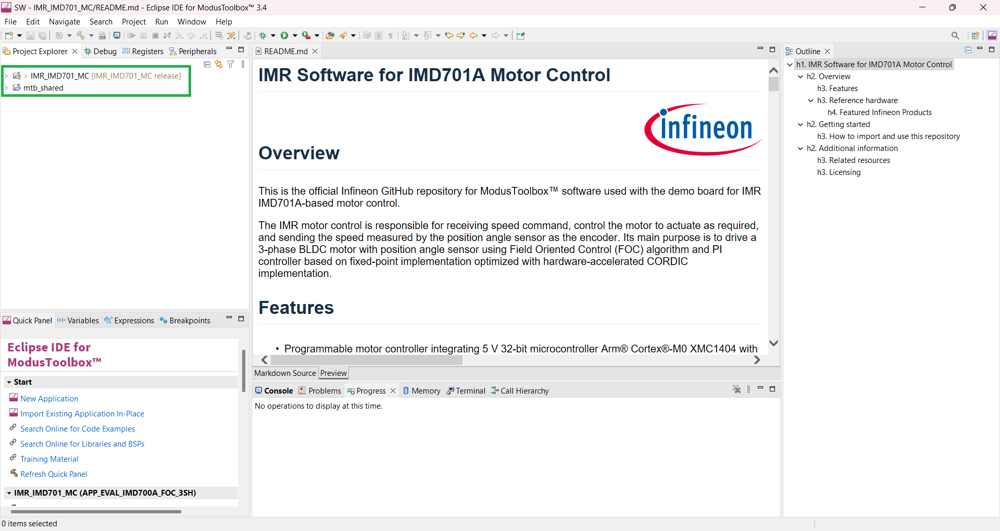
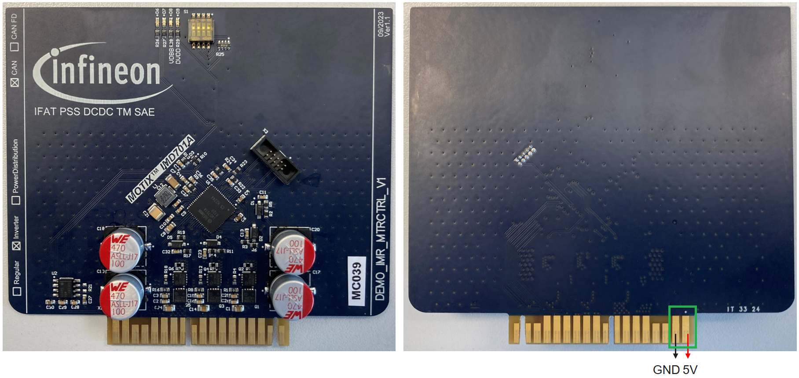

<!--
SPDX-FileCopyrightText: Copyright (c) 2024 Infineon Technologies AG
SPDX-License-Identifier: MIT
-->

# IMR Software for IMD701A Motor Control 

 
 

## Overview

This is the official Infineon GitHub repository for ModusToolbox™ software used with the demo board for IMR IMD701A-based motor control.

The IMR motor control is responsible for receiving speed command, control the motor to actuate as required, and sending the speed measured by the position angle sensor as the encoder. Its main purpose is to drive a 3-phase BLDC motor with position angle sensor using Field Oriented Control (FOC) algorithm and PI controller based on fixed-point implementation optimized with hardware-accelerated CORDIC implementation.

### Features

- Programmable motor controller integrating 5 V 32-bit microcontroller Arm® Cortex®-M0 XMC1404 with smart 3-phase gate driver IC 6EDL7141
- CAN bus communication with onboard CAN transceiver
- Onboard DIP switch for unique board identification
- Low Rds(on) in small package MOSFETs for the motor inverters
- Magnetic angle sensor as the position sensor / encoder on a <a href="https://www.infineon.com/cms/en/product/evaluation-boards/demo_imr_angle_sens_v1/">separate board</a>
- Absolute and incremental position possible with only Incremental Interface (IIF) i.e. no SSC / SPI interface is needed

### Reference hardware

This software is meant to run on following reference hardware:

- <a href="https://www.infineon.com/cms/en/product/evaluation-boards/demo_imr_mtrctrl_v1/">DEMO_IMR_MTRCTRL_V1 - Demo board for IMR motor control</a> 
- <a href="https://www.infineon.com/cms/en/product/evaluation-boards/demo_imr_angle_sens_v1/">DEMO_IMR_ANGLE_SENS_V1 - Demo board for IMR encoder</a>

#### Featured Infineon Products 

Following products are featured by the reference hardware:
 
 
<table style="width:100%">
  <tr>
    <th>Product</th>
    <th>Description</th>
  </tr>
  <tr>
    <td><a href="https://www.infineon.com/cms/en/product/power/motor-control-ics/bldc-motor-control-ics/battery-supplied-bldc-motor-controller-ics/imd701a-q064x128-aa/">IMD701A-Q064X128-AA</a></td>
    <td>MOTIX™ fully programmable motor controller combining microcontroller and gate driver IC</td>
  </tr>
  <tr>
    <td><a href="https://www.infineon.com/cms/en/product/power/mosfet/n-channel/isz053n08nm6/">ISZ053N08NM6</a></td>
    <td>OptiMOS™ 6 N-channel power MOSFET 80 V 5.3 mOhm in PQFN 3.3 x 3.3</td>
  </tr>
  <tr>
    <td><a href="https://www.infineon.com/cms/en/product/transceivers/automotive-transceiver/automotive-can-transceivers/tle9351bvsj/">TLE9351BVSJ</a></td>
    <td>High speed CAN transceiver for CAN and CAN FD</td>
  </tr>
  <tr>
    <td><a href="https://www.infineon.com/cms/en/product/small-signal-transistors-diodes/diode/schottky-diodes/bas52-02v/">BAS52-02V</a></td>
    <td>45 V Silicon Schottky diode with low forward voltage at 200 mA</td>
  </tr>
  <tr>
    <td><a href="https://www.infineon.com/cms/en/product/sensor/magnetic-sensors/magnetic-position-sensors/angle-sensors/tle5012b-e1000/">TLE5012B E1000</a></td>
    <td>XENSIV™ 360° GMR magnetic angle sensor with SPI/IIF interface</td>
  </tr>
  <tr>
    <td><a href="https://www.infineon.com/cms/en/product/power/mosfet/p-channel/irlml6401/">IRLML6401</a></td>
    <td>12V Single P-Channel Power MOSFET in a SOT-23 package</td>
  </tr>
</table>

 

## Getting started

### How to import and use this repository
<ol>
<li> Install and start ModusToolbox™ and select a workspace to be used (tested with Version 3.3, and 3.4).
<li> Import the project with the import wizard by pressing 'File' – 'Import…'.   
    <picture>
        
    </picture>
     
    &nbsp;
</li>
<li> Select 'ModusToolbox™' – 'Import Existing Application In-Place' and press 'Next'.   
    <picture>
        
    </picture>
     
    &nbsp;
</li>
<li> Find the Project Location by pressing 'Browse…'.   
    <picture>
        
    </picture>
     
    &nbsp;
</li>
<li> Select the project folder accordingly and press 'Finish'.   
    <picture>
        
    </picture>
     
    &nbsp;
</li>
<li> Wait until the project is fully imported.   
    <picture>
        
    </picture>
     
    &nbsp;
</li>
<li> Notice that additional folder 'mtb_shared' should be created (if there was none) when the import is completed.   
    <picture>
        
    </picture>
     
    &nbsp;
</li>
<li> Right click the project folder and select 'ModusToolbox™' followed by 'Library Manager 2...'.   
    <picture>
        
    </picture>
     
    &nbsp;
</li>
<li> Press the 'Update' button   
    <picture>
        
    </picture>
     
    &nbsp;
</li>
<li> When the Update is completed the sucessful messages should be displayed. If the update failed, try it again by repressing the 'Update' button. If this also fails try to clean the project, before trying it again.   
    <picture>
        
    </picture>
     
    &nbsp;
</li>
<li> Before building the project it is recommended to clean it by pressing 'Clean Application'.   
    <picture>
        
    </picture>
     
    &nbsp;
</li>
<li> Finally the project can be compiled by pressing 'Build Application'.   
    <picture>
        
    </picture>
     
    &nbsp;
</li>
<li> Before flashing the project onto the board, connect the XMC™ Link Programming adapter using the 10-pin flat cable and <a href="./assets/DEMO_IMR_PROGADPTR_V1@e7eacb3013a-zip">the programming adapter</a> to provide power to the board. If the programming adapter is not available, additional wires need to be connected to the edge-card pins as indicated in the image below.   
	<picture>
        
    </picture>
     
	<picture>
        
    </picture>
     
    &nbsp;
</li>
<li> Finally to flash the project onto the board, use the green play button in ModusToolbox™ on the bottom left - 'Quick Panel' - 'Launches' - 'IMR_IMD701_MC Program (JLink)' to initiate the process.  
	<picture>
        
    </picture>
     
    &nbsp;
</li>
</ol>

## Additional information

Precise definition of the software and its features can be found in the close-to-code documentation on top of each file, at the specific function itself and in the software documentation.

### Related resources

- [Robotics development platform: Infineon Mobile Robot (IMR)](https://www.infineon.com/cms/de/applications/robotics/development-platform/)

### Licensing

Please see our [LICENSE](LICENSE) for copyright and license information.
